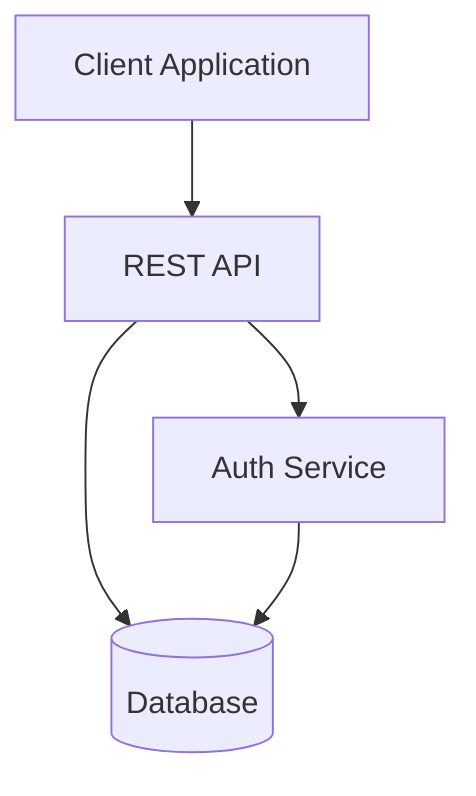

# Code Documentation Skill

## Overview

This skill generates rigorous documentation from multiple sources (GitHub, web pages, Google Drive, Notion, local files) with **per-sentence accuracy tracking**. Each statement includes an inline source citation and a confidence score. Statements below a user-defined accuracy threshold are excluded.

## Trigger Phrases

This skill activates automatically when you use phrases like:

**Korean (한국어)**:
- 코드 문서화해줘 / 문서 생성해줘
- API 레퍼런스 만들어줘 / 작성해줘
- 시스템 오버뷰 작성해줘 / 만들어줘
- 튜토리얼 만들어줘 / 작성해줘
- PR #123 코멘트 반영해줘

**English**:
- Document this code/module/API
- Create/generate/write API reference
- Write system overview/architecture doc
- Generate tutorial/guide
- Update documentation from PR comments

**💡 Tip**: If skill doesn't activate automatically, use explicit prefix:
- `code-documentation 코드 문서화해줘`
- `code-documentation generate API reference`

The skill supports **progressive refinement**: users can add questions/answers as GitHub PR comments, and Claude will update the documentation based on that feedback.

## When to Use This Skill

Trigger this skill when:
- "코드 문서화해줘" / "Document this code"
- "API 레퍼런스 만들어줘" / "Create API reference"
- "시스템 오버뷰 작성해줘" / "Write system overview"
- "이 모듈 문서 생성해줘" / "Generate documentation for this module"

## Workflow

### Phase 1: Configuration Collection

Before analyzing any code or sources, collect the following settings from the user:

#### 1.1 Source Links

Ask: "What sources should I analyze for documentation?"

Supported source types:
- **GitHub URLs**: File links, line ranges, PR URLs, issue URLs
  - Example: `https://github.com/org/repo/blob/main/src/file.rs#L10-L50`
- **Web Pages**: Any public URL
  - Example: `https://docs.example.com/api-guide`
- **Google Drive**: Document/spreadsheet links (requires MCP server or user-provided content)
- **Notion Pages**: Notion URLs (requires MCP server or user-provided content)
- **Local Files**: Relative paths (no `file://` prefix), including PDFs
  - Example: `src/module.py`, `docs/design.md`

**Follow-up: Document Scope**

If multiple sources provided (e.g., multiple modules, multiple files), ask:

```
"Should I create:
1. **Single document** - Combine all sources into one comprehensive document
2. **Multiple documents** - One document per module/component
3. **Let me decide** - I'll suggest based on source structure and relationships"
```

**For multiple documents:**
- Maintain consistent accuracy threshold across all docs
- Use same template/style for consistency
- Report summary at end:
  ```
  Generated 3 documents:
  - parser-api.md (15 functions, avg 87%, 3 gaps)
  - validator-api.md (8 functions, avg 91%, 1 gap)
  - transformer-api.md (12 functions, avg 84%, 5 gaps)

  Total: 35 functions documented across 3 modules
  ```

#### 1.2 Document Type

Ask: "What type of documentation should I create?"

Options:
- **API Reference**: Function/method signatures, parameters, return values, examples
- **System Overview**: Architecture, components, data flow
- **Tutorial**: Step-by-step guide with code examples
- **Custom**: User defines structure

#### 1.3 Accuracy Threshold

Ask: "What's the minimum accuracy for including statements? (e.g., 70%)"

Explanation:
- Statements with accuracy below this threshold will be **excluded** from the document
- Higher threshold = more conservative, fewer but more reliable statements
- Lower threshold = more comprehensive, but includes more inference

Recommended:
- 80-90%: High-confidence documentation (API references, critical systems)
- 70-79%: Balanced documentation (most use cases)
- 60-69%: Exploratory documentation (early-stage analysis)

#### 1.4 Template/Style Selection

Ask about:
- **Document Structure**: Which sections to include (based on doc type)
- **Markdown Style**: Heading levels, code block preferences
- **Existing Template**: Does the project have a documentation template to follow?

### Phase 2: Document Generation

#### 2.1 Source Access Strategy

For each source type, use the appropriate tool:

| Source Type | Access Method | Notes |
|-------------|---------------|-------|
| GitHub (local) | Read tool | For files in current workspace |
| GitHub (remote) | WebFetch tool | For external repositories |
| GitHub (PR/Issues) | `gh` CLI | For PR comments, issue discussions |
| Public web pages | WebFetch tool | Direct URL fetch |
| Local files | Read tool | Supports PDF, text files, code |
| Google Drive | MCP server (`mcp__gdrive__*`) | If available; else ask user for content |
| Notion | MCP server (`mcp__notion__*`) | If available; else ask user for content |

**Important**: If an MCP server is available for Google Drive/Notion, use it. Otherwise, politely ask the user: "I don't have direct access to [Google Drive/Notion]. Could you copy the relevant content here?"

#### 2.2 Accuracy Calculation

For each statement you write, calculate accuracy based on:

**Accuracy = How confidently can I claim this based on available evidence?**

| Accuracy Range | Criteria | Example |
|----------------|----------|---------|
| **90-100%** | Direct fact from source code/documentation, verbatim or nearly verbatim | "Function `parse()` accepts a `String` parameter" (directly visible in code) |
| **70-89%** | Clear inference from multiple facts, logically sound combination | "This module handles authentication" (inferred from function names, imports, comments) |
| **50-69%** | Inference with some speculation, pattern-based guessing | "This function likely retries on failure" (pattern seen but not explicitly documented) |
| **0-49%** | Mostly speculation, insufficient evidence | "This probably uses caching" (no direct evidence) |

**Key principle**: Be honest. If you're guessing, the accuracy should be low. If accuracy is below threshold, **exclude the statement entirely**.

**Accuracy Rationale (Recommended)**

For statements with accuracy 70-90%, or when combining multiple sources, **provide a rationale** using blockquote format directly below the statement:

```markdown
Statement content ([Source](URL)) [accuracy%]
> Rationale: [breakdown of confidence factors]
```

**Rationale components** (total should sum to accuracy%):
- Direct observation from code: +40-60%
- Clear inference from structure/logic: +20-30%
- Naming conventions/documentation hints: +10-20%
- Pattern recognition/common practices: +5-15%

**Example:**

```markdown
The `process()` function validates and sanitizes input ([Source](https://github.com/org/repo/blob/main/src/lib.rs#L50)) [85%]
> Rationale: Direct code inspection confirms validation call (50%), function name suggests sanitization (20%), parameter type hints support this (15%)
```

**When to include rationale:**
- ✅ Statements with 70-90% accuracy (helps explain inference)
- ✅ Statements combining multiple sources
- ✅ Complex claims that might be questioned
- ❌ Statements with 95-100% accuracy (obvious from source)
- ❌ Simple, straightforward facts

#### 2.3 Writing Rules

Every statement must follow this format:

```markdown
Statement content ([Source](URL)) [accuracy%]
```

**Examples:**

**High-confidence statement (no rationale needed):**
```markdown
The `calculate()` function performs matrix multiplication ([Source](https://github.com/org/repo/blob/main/src/math.rs#L45)) [95%]
```

**Local file citation (use relative path, no file:// prefix):**
```markdown
The Parser struct implements recursive descent algorithm ([Source](src/parser.rs#L120)) [93%]
```

**Inference-based statement (rationale recommended):**
```markdown
This module is responsible for user authentication ([Source1](https://github.com/org/repo/blob/main/src/auth.rs#L10), [Source2](https://github.com/org/repo/blob/main/README.md#L23)) [82%]
> Rationale: Module named 'auth' (30%), contains login/logout/verify functions (30%), README explicitly mentions "handles authentication" (22%)
```

**Multiple sources:**
```markdown
Statement ([Source1](URL1), [Source2](URL2), [Source3](URL3)) [confidence%]
```

**Rules:**
1. **Every statement** needs a source link and accuracy score
2. Statements with `accuracy < threshold` are **excluded** (do not write them)
3. Follow reference links automatically, but limit depth (e.g., 2 levels) to avoid infinite loops
4. If a statement is uncertain but important, acknowledge the gap:
   ```markdown
   <!-- Analysis Gap: Unable to determine retry behavior with sufficient confidence (sources analyzed: file.rs:100-150, docs.md) -->
   ```

#### 2.3.1 Technical Writing Style

Follow these principles for clear, consistent technical documentation:

**Clarity**
- Use precise technical terms, avoid ambiguity
- Define acronyms on first use: "API (Application Programming Interface)"
- Prefer active voice: "Function X validates input" > "Input is validated by function X"
- One concept per sentence when possible

**Conciseness**
- Eliminate filler words: "basically", "actually", "in order to" → "to"
- Avoid redundancy: "combine together" → "combine"
- Target 15-25 words per sentence for complex technical content

**Consistency**
- Use same terminology throughout document (don't alternate "function"/"method" for same thing)
- Follow project conventions: if codebase uses "handler", use "handler" not "processor"
- Maintain consistent verb tense: present tense for current behavior

**Structure**
- Lead with the main point: "Function X parses JSON" before explaining how
- Use parallel structure in lists: all items start with verbs or all start with nouns
- Order information logically: what → why → how

**Examples**

❌ **Bad:**
```markdown
The validation function is basically used to actually validate the input data that's being provided to the system in order to make sure it's correct.
```

✅ **Good:**
```markdown
The `validate()` function checks input data for correctness before processing ([Source](URL)) [90%]
```

❌ **Bad (inconsistent):**
```markdown
The parser processes JSON. Then the handler will parse XML. Finally, the processor transforms output.
```

✅ **Good (consistent):**
```markdown
The parser processes JSON input ([Source](URL)) [95%]
The parser processes XML input ([Source](URL)) [95%]
The transformer converts output format ([Source](URL)) [92%]
```

**When combining multiple sources:**

Template: `[Main claim] [supporting detail 1], [supporting detail 2] ([Sources]) [accuracy%]`

Example:
```markdown
The `authenticate()` function validates JWT tokens using RS256 algorithm, with a 1-hour expiration window ([Source1](code), [Source2](config), [Source3](docs)) [88%]
> Rationale: Code shows JWT validation (50%), config specifies RS256 (20%), docs confirm 1-hour timeout (18%)
```

**Special cases:**

- **Uncertain behavior**: Use qualifiers explicitly
  - "appears to", "likely", "may" → signals lower confidence, adjust accuracy accordingly

- **Version-specific**: Note version when behavior varies
  - "In v2.0+, function X supports async mode ([Source](changelog)) [95%]"

- **Deprecated features**: Mark clearly
  - "**Deprecated in v3.0**: Function X (use Y instead) ([Source](URL)) [95%]"

**Rich Formatting (GitHub-supported formats only):**

Use GitHub's native features for clear, expressive documentation:

**Diagrams (Mermaid):**
```markdown

```

Diagram types: `graph TD/LR` (flowchart), `sequenceDiagram`, `classDiagram`, `stateDiagram`, `erDiagram`

**Tables:**
```markdown
| Parameter | Type | Required | Description |
|-----------|------|----------|-------------|
| `user_id` | int  | Yes      | User identifier |
| `token`   | str  | Yes      | Auth token |
```

**Collapsible sections (for long content):**
```markdown
<details>
<summary>Implementation Details</summary>

[Detailed explanation with code examples]
</details>
```

**Alerts/Callouts (GitHub-style):**
```markdown
> [!NOTE]
> This function is thread-safe as of v2.0

> [!WARNING]
> Deprecated in v3.0 - use `newFunction()` instead

> [!IMPORTANT]
> Must call `initialize()` before first use
```

**Code blocks with highlighting:**
````markdown
```rust
// Syntax highlighting improves readability
fn process(input: &str) -> Result<Output> {
    validate(input)?
}
```
````

**Task lists:**
```markdown
- [x] Implemented basic parsing
- [x] Added error handling
- [ ] TODO: Add async support
```

#### 2.4 Document Structure

All generated documents must include metadata at the top:

```markdown
# [Document Title]

**Generated**: YYYY-MM-DD
**Accuracy Threshold**: [user-set value]%
**Last Updated**: YYYY-MM-DD
**Sources Analyzed**: [count]

## Changelog

### [YYYY-MM-DD] - Initial Generation
- Generated from [source list]
- [X] statements documented (avg accuracy: [Y]%)
- [Z] analysis gaps identified

---

[Document content with inline citations and accuracy scores]
```

**Changelog format for updates:**

When updating documentation based on PR comments or new sources:

```markdown
## Changelog

### [YYYY-MM-DD] - PR #123 Integration
- Updated `process()` function: Added sanitization behavior
- Corrected `validate()` parameters: Changed type from String to &str
- Added new section: Error Handling
- Resolved 1 conflict: validation behavior (see line 45 TODO)
- 3 statements updated, 2 added, average accuracy: 87% → 91%

### [YYYY-MM-DD] - Initial Generation
- Generated from src/lib.rs
- 42 statements documented (avg accuracy: 87%)
- 3 analysis gaps identified
```

#### 2.5 Save Document

After generating the document:
1. Show the document to the user (full preview)
2. Ask for filename (suggest based on doc type)
3. Save as markdown file using Write tool
4. Confirm: "Document saved to `[filename].md` with [X] statements (avg accuracy: [Y]%)"

### Phase 3: PR Comment Integration

#### 3.1 User Workflow

After Claude generates documentation:
1. User creates a PR with the generated markdown file
2. User reviews the document and adds comments to the PR:
   - **Line-specific comments**: Questions/corrections about specific statements
   - **General comments**: Overall feedback, missing information
3. User triggers update: "PR #123 코멘트 반영해줘" / "Update docs with PR #123 comments"

#### 3.2 Claude Processing

When user requests PR comment integration:

**Step 1: Fetch PR Comments**
```bash
gh pr view #123 --json comments,reviews
```

Parse both general comments and line-specific review comments.

**Step 2: Analyze Each Comment**

For each comment:
- **Line-specific on doc file**: Match by line number directly
- **Line-specific on code file**: Map to doc section by finding related content
  - Extract function/class/module name from code file:line
  - Search doc for matching section (e.g., "### `functionName()`")
  - If not found in doc, add to appropriate section or create new entry
- **General comment**: Use keywords to find relevant sections

**Example: Code file comment mapping**
```
PR Comment: "src/lib.rs:50: This function also performs caching"

Processing:
1. Parse comment: file=src/lib.rs, line=50
2. Read src/lib.rs:50 → identify function name: `process()`
3. Search doc for section "### `process()`"
4. Update that section with caching information
```

**Step 3: Update Document**

Based on comment type:

| Comment Type | Action |
|--------------|--------|
| **Correction** | Update the statement, adjust source citation, recalculate accuracy |
| **Additional Info** | Add new statement or extend existing one, cite PR comment as source |
| **Question** | If you can answer with existing sources, add clarification; otherwise, note the gap |

**Step 4: Citation Format for PR Comments**

When incorporating information from PR comments:
```markdown
Statement incorporating PR feedback ([Source](original-url), [PR Comment](pr-comment-url)) [90%]
```

**Note**: Information from PR comments is generally high-confidence (90-95%) because it comes from project maintainers/reviewers with domain knowledge.

**Step 5: Update Metadata**
```markdown
**Last Updated**: YYYY-MM-DD
```

**Step 6: Save and Confirm**

Save updated document and report:
```
Document updated based on PR #123 comments:
- 3 statements corrected
- 2 new statements added
- 1 gap identified (see line 145)
Average accuracy: 88% → 91%
```

#### 3.3 Example: PR Comment Processing

**Original statement:**
```markdown
The `process()` function handles data validation ([Source](https://github.com/org/repo/blob/main/src/lib.rs#L50)) [85%]
```

**PR Comment (line 15):**
> "This function also performs sanitization, not just validation."

**Updated statement:**
```markdown
The `process()` function handles data validation and sanitization ([Source](https://github.com/org/repo/blob/main/src/lib.rs#L50), [PR Comment](https://github.com/org/repo/pull/123#discussion_r987654)) [95%]
```

#### 3.4 Conflict Resolution

When PR comment **contradicts** existing source (not just adds information):

**Step 1: Detect Conflict**
- Compare new information with existing statement
- Check if they're incompatible (not just additive)
- Example conflicts:
  - Old: "accepts String", New: "accepts &str"
  - Old: "synchronous", New: "asynchronous"
  - Old: "validates only", New: "validates and sanitizes"

**Step 2: Replace + TODO**

When conflict detected, replace the statement with new information and add TODO:

```markdown
<!-- Previous: X performs validation only ([Source](url1)) [85%] -->
X performs validation and sanitization ([Source](url1), [PR Comment](url2)) [90%]
<!-- TODO: Conflict detected. Original source indicated validation only, PR comment indicates sanitization also occurs. Please verify which is correct or if implementation changed. -->
```

**Step 3: Report**
```
⚠️ Conflict detected on line 45:
  Old: "X performs validation only" (from src/lib.rs)
  New: "X performs validation and sanitization" (from PR comment @maintainer)

Action taken: Updated statement with new info, added TODO for verification.
Rationale: PR comment from maintainer is more recent/authoritative.
```

**Decision priority** (when in doubt):
1. PR comment from project maintainer > code
2. Code > external documentation
3. Most recent information > older information
4. If truly uncertain → create TODO for human verification

#### 3.5 Incremental Updates

**Auto-detection workflow:**

Instead of regenerating entire document, update only affected sections.

**Step 1: Analyze PR comments → Determine scope**

For each comment, determine affected scope:

| Comment Location | Scope Strategy | Example |
|------------------|----------------|---------|
| Doc file line-specific | Exact line/statement | Comment on line 45 → update that statement |
| Code file line-specific | Find related doc section | Comment on src/lib.rs:50 `process()` → update "### `process()`" section |
| General comment | Keyword/topic matching | Comment mentions "error handling" → update Error Handling section |

**Step 2: Execute scoped update**

- **Narrow scope** (single function/class): Update only that item, preserve rest
- **Medium scope** (section-level): Regenerate entire section
- **Wide scope** (affects multiple sections): Mark all affected sections, update each

**Example flow:**

```
PR #123 has 3 comments:
1. src/lib.rs:50 about `process()` → Narrow scope: update process() function doc
2. "Error handling is incomplete" → Medium scope: regenerate Error Handling section
3. docs/api.md:15 typo correction → Narrow scope: fix that line

Result:
- Functions > process(): 2 statements updated
- Error Handling: section regenerated (4 statements added)
- Line 15: typo fixed

Rest of document unchanged.
```

**Step 3: Report affected areas**

```
Updated sections based on PR #123:
- Functions > process() (2 statements changed, +1 added)
- Error Handling (section regenerated, 4 statements added)
- Line 15 typo corrected

Sections unchanged:
- Overview, Types, Constants, Usage Patterns

Average accuracy: 87% → 89%
```

**Manual override:**

User can explicitly specify scope:
```bash
"Functions 섹션만 업데이트해줘"
"parse() 함수만 업데이트해줘"
"전체 문서 재생성해줘"
```

## Core Principles

### 1. Accuracy-Based Filtering
**Better to have gaps than speculation.**

If you cannot confidently verify a statement:
- Accuracy < threshold → Exclude it
- Leave a gap comment if it's an important missing piece
- Never include low-confidence claims just to "fill out" the document

### 2. Source Transparency
**Every claim needs a link.**

No statements without source citations. If you can't cite a source, you can't make the claim.

### 3. Progressive Refinement
**Documentation improves through feedback.**

Initial generation may have gaps. Users fill gaps via PR comments. This is expected and encouraged.

### 4. Source Diversity
**Use all available information.**

Combine:
- Code (primary source)
- Documentation (official explanations)
- Web resources (external guides, blog posts)
- PR comments (domain expert feedback)

### 5. MCP-First
**Leverage integrations when available.**

Check for MCP servers before asking users to manually provide content:
```
ListMcpResourcesTool → check for notion/gdrive servers
```

## Templates

Templates are available in `references/`:
- `template-api-reference.md` - API documentation structure
- `template-overview.md` - System architecture documentation
- `template-tutorial.md` - Step-by-step guide structure

### Template Selection Rules

| User Request | Template Choice | Rationale |
|--------------|-----------------|-----------|
| "API 문서", "함수 문서", "메서드 레퍼런스" | template-api-reference.md | Function/method/class documentation |
| "시스템 오버뷰", "아키텍처", "구조 설명" | template-overview.md | High-level architecture and components |
| "튜토리얼", "가이드", "How to", "따라하기" | template-tutorial.md | Step-by-step instructions |
| Ambiguous or custom | Ask user: "Should this be API reference, overview, or tutorial?" | User clarification |

### Template Adaptation

- **Keep template structure** (sections/headings) for consistency
- **Adjust content** based on actual findings from sources
- **Add/remove sections** as needed (e.g., if no constants found, omit Constants section)
- **Maintain citation format** `([Source](URL)) [accuracy%]` throughout
- **Follow Changelog format** for all updates
- **Include rationale blockquotes** for 70-90% accuracy statements

**Project-specific templates:**

If user mentions "use project template" or "follow existing docs":
1. Ask for template location
2. Read template file
3. Extract structure (headings, sections)
4. Apply same structure to new documentation
5. Maintain accuracy scoring system

## Error Handling

### Insufficient Sources
If sources are too limited to meet accuracy threshold:
```
⚠️ Warning: Only [X]% of planned sections could be documented at [threshold]% confidence.

Documented sections: [list]
Insufficient information for: [list]

Recommendation: Lower threshold to [Y]% or provide additional sources.
```

### MCP Server Unavailable
If Google Drive/Notion MCP server is not configured:
```
I don't have direct access to [platform]. To include this source, please:
1. Copy the relevant content here, OR
2. Install the [platform] MCP server (see: [link to docs])
```

### PR Not Found
If `gh pr view` fails:
```
❌ Could not fetch PR #123. Please check:
- PR number is correct
- You have gh CLI authenticated
- Repository access is granted
```

## Success Criteria

A well-documented output will have:
- ✅ Clear metadata (generated date, threshold, last updated)
- ✅ Every statement with inline source + accuracy score
- ✅ No statements below user-defined threshold
- ✅ Honest acknowledgment of gaps (via comments)
- ✅ Clean markdown formatting
- ✅ Saved to file (not just chat output)

## Example Interaction

```
User: "API 문서 만들어줘. src/parser.rs 분석해서, 최소 정확도 80%로"

Claude:
1. Collecting configuration...
   - Source: src/parser.rs
   - Type: API Reference
   - Threshold: 80%
   - Template: API Reference template

2. Analyzing source...
   [reads file, extracts functions, parameters, logic]

3. Generating documentation...
   - 15 functions found
   - 42 statements written (all ≥80% confidence)
   - 3 gaps identified (insufficient info)

4. Document preview:
   [shows full markdown with [85%], [92%], etc. on each statement]

5. Saving to `parser-api.md`...
   ✅ Done. Average accuracy: 87%

---

User: [creates PR #456 with the file, adds comments]
User: "PR #456 코멘트 반영해줘"

Claude:
1. Fetching PR #456 comments...
   - 2 line-specific comments found
   - 1 general comment found

2. Processing comments...
   - Line 23: Corrected parameter description [updated, 90%]
   - Line 45: Added caching behavior info [new statement, 95%]
   - General: Clarified error handling section [2 statements updated]

3. Updated `parser-api.md`
   - 3 statements corrected
   - 1 new statement added
   - Average accuracy: 87% → 91%

✅ Document updated successfully.
```
